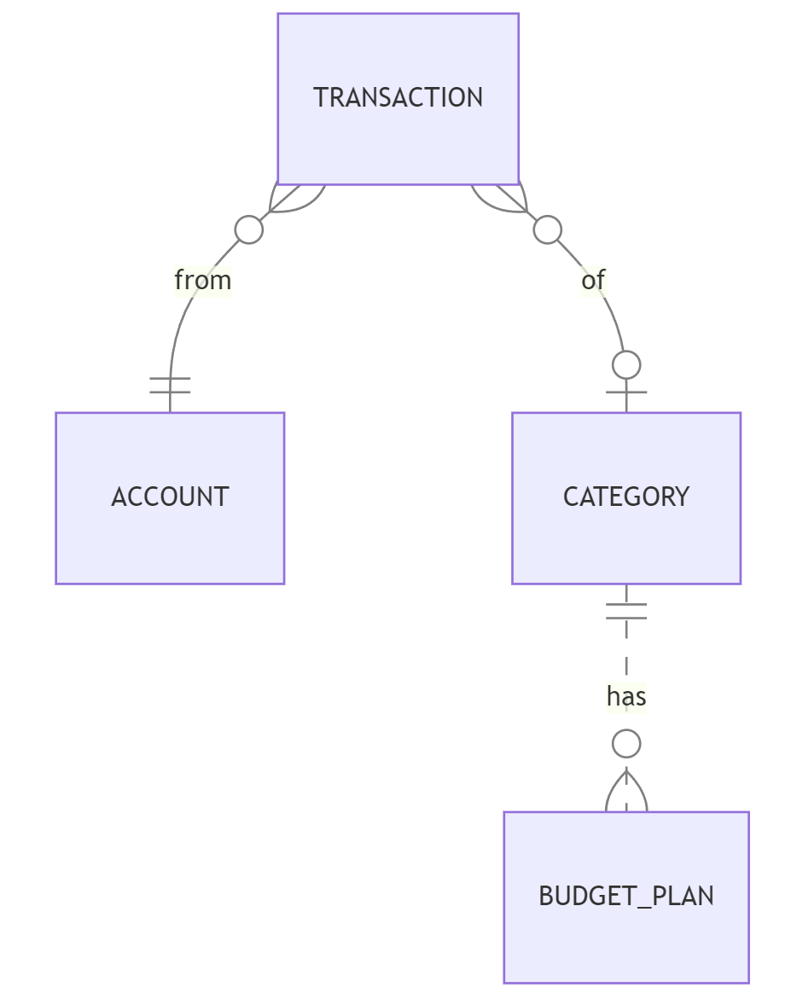

# Design Document

By Ashish Nain

# Scope

The purpose of the database is to manage and track financial transactions, budget plans, and account balances for a user. It provides a way to record income and expense transactions, categorize them, and compare actual spending against budgeted amounts.

## Included in Scope
* User's financial accounts (e.g., bank accounts, credit cards, cash)
* Financial transactions (income and expenses)
* Transaction categories (e.g., Groceries, Entertainment)
* Budget plans linked to categories

Out of scope are elements like loans, interest rates, credit limits, multi-currency support, multi-user support, recurring transactions management.

# Functional Requirements

This database will support:

* Add, view, and manage financial accounts
* Record, view, and manage transactions (income and expenses)
* Categorize transactions
* Set and view budget plans
* Generate and view financial summaries (monthly financial summary, budget vs.actual spending, recent transactions, category summary)
* Retrieve transactions by various filters (date range, account, category, transaction type)
* Trigger to automatically update account balance after a transaction is inserted

## Beyond the Scope
* Tracking of transaction timestamps (exact time of day for transactions)
* Integration with external financial systems
* Loans, interest rates, credit limits, recurring trasactions, multi-currency support, multi-user support

## Representation

Entities are captured in SQLite tables with the following schema.

## Entities

The database includes the following entities:

### Accounts

The `accounts` table includes:

* `account_id`: This column specifies the unique ID for the account as an `INTEGER`. This column has the `PRIMARY KEY` constraint applied to ensure each account has a unique identifier.
* `account_name`: This column specifies the name of the account as `TEXT`, appropriate for a name field. A `UNIQUE` constraint ensures no two accounts have the same name, preventing duplicates and ensuring clarity.
* `account_type`: This column specifies the type of account (e.g., Bank Account, Credit Card, Cash) as `TEXT`, which is appropriate for categorical data.
* `balance`: This column specifies the balance of the account as a `REAL` number. The `NOT NULL` constraint ensures every account has a balance, and it has `DEFAULT` value of `0.0`.

### Categories

The `categories` table includes:

* `category_id`: This column specifies the unique ID for the category as an `INTEGER`. This column has the `PRIMARY KEY` constraint applied to ensure each category has a unique identifier.
* `name`: This column specifies the name of the category as `TEXT`, appropriate for descriptive names. The `NOT NULL` constraint ensures every category has a name, and the `UNIQUE` constraint ensures no two categories have the same name.

### Transactions

The `transactions` table includes:

* `transaction_id`: This column specifies the unique ID for the transaction as an `INTEGER`. This column has the `PRIMARY KEY` constraint applied to ensure each transaction has a unique identifier.
* `account_id`: This column specifies the ID of the related account as an `INTEGER`. A `NOT NULL` constraint ensures every transaction is linked to an account. A `FOREIGN KEY` constraint references the `account_id` in the `accounts` table, maintaining referential integrity.
* `transaction_date`: This column specifies the date of the transaction as a `DATE`. A `NOT NULL` constraint ensures every transaction has a date. The `DEFAULT` value is set to the current date.
* `transaction_type`: This column specifies the type of transaction (either 'Income' or 'Expense') as `TEXT`. A `CHECK` constraint ensures only these two values are allowed, maintaining data integrity.
* `amount`: This column specifies the amount of the transaction as a `REAL` number. A `NOT NULL` constraint ensures every transaction has an amount. A `CHECK` constraint ensures the amount is greater than zero.
* `category_id`: This column specifies the ID of the related category as an `INTEGER`. This column is optional, allowing transactions without a category. A `FOREIGN KEY` constraint references the `category_id` in the `categories` table, maintaining referential integrity.
* `description`: This column specifies a description of the transaction as `TEXT`, providing additional details about the transaction.

### Budget Plans

The `budget_plans` table includes:

* `budget_id`: This column specifies the unique ID for the budget plan as an `INTEGER`. This column has the `PRIMARY KEY` constraint applied to ensure each budget plan has a unique identifier.
* `category_id`: This column specifies the ID of the related category as an `INTEGER`. A `NOT NULL` constraint ensures every budget plan is linked to a category. A `FOREIGN KEY` constraint references the `category_id` in the `categories` table, maintaining referential integrity.
* `budget_month`: This column specifies the month of the budget plan as `TEXT` in the format 'YYYY-MM'. A `NOT NULL` constraint ensures every budget plan has a month. The `DEFAULT` value is set to the current month.
* `budget_amount`: This column specifies the budgeted amount for the category as a `REAL` number. A `NOT NULL` constraint ensures every budget plan has an amount.
* A `UNIQUE` constraint has been applied on the combination of `category_id` and `budget_month` to ensure that there can only be one budget plan per category for each month.

A `TRIGGER`- `after_transaction_insert_update_balance` has also been defined to automatically update account balance after a transaction is inserted

## Relationships

The below entity relationship diagram describes the relationships among the entities in the database.

As detailed by the diagram:

* An account can have zero to many transactions. A transaction is associated with one and only one account.
* A category can have zero to many transactions. A transaction can be associated with no (zero) category or only one category.
* A budget plan is associated with one and only one category. A category can have zero to many budget plans. But the `budget_plan` table has `UNIQUE` constraint applied to the combination of `category_id` and `budget_month`. Therefore, there can be zero or only one budget plan for every month.

# Optimizations

## Indexes

* Index on `transaction_date` in `transactions` table .This index speeds up queries that filter or sort transactions by date, which is a common operation when viewing transactions over time or generating monthly summaries.
* Composite Index on `account_id` and `transaction_date` in `transactions` table.  This index optimizes searches that filter transactions by account and date, which is useful for viewing account-specific transaction history.
* Composite Index on `category_id` and `transaction_date` in `transactions` table. This index enhances the performance of queries filtering by category and date, important for generating category-based reports and summaries.

## Views
* Monthly Financial Summary View: This view provides a summarized overview of income and expenses per month, useful for quick financial performance analysis.
* Budget vs. Actual Spending View: This view compares the budgeted amount against the actual spending per category and month, aiding in budget management and analysis.
* Recent Transactions View: This view provides a quick look at the 10 most recent transactions, which is helpful for monitoring recent financial activity.
* Category Summary View: This view summarizes transactions by category and month, facilitating detailed analysis of spending and income per category.

# Limitations

* The current design restricts transaction types to 'Income' and 'Expense'. If additional types, such as 'Transfer', are needed, the schema would require modifications to accommodate these new transaction types.
* The current design only tracks the date of transactions, not the exact time. This limits the ability to precisely order transactions that occur on the same day or to analyze intra-day spending patterns.
* Budget planning is currently restricted to monthly periods. The design lacks flexibility to support other budget periods such as weekly or yearly budgets
* The design does not support loans, credit limits, interest rates, recurring transactions, multiple users, multiple currencies, or detailed financial goal planning.

# Schema file
https://github.com/ashishnain-sudo/my-portfolio/blob/6f796acc1e6958d1456072d28b23b6aa9c3d2e00/personal_finance_management_db/schema.sql

# Sample queries

https://github.com/ashishnain-sudo/my-portfolio/blob/6f796acc1e6958d1456072d28b23b6aa9c3d2e00/personal_finance_management_db/queries.sql
